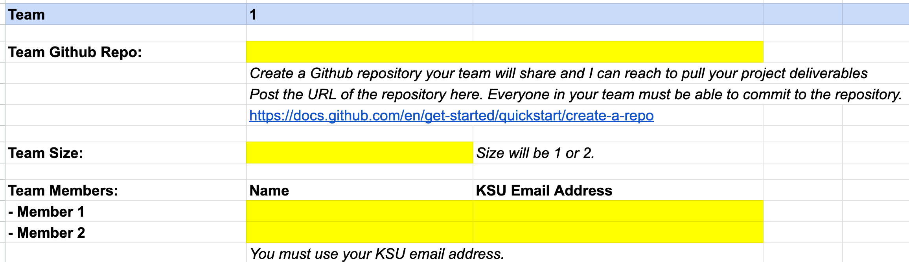
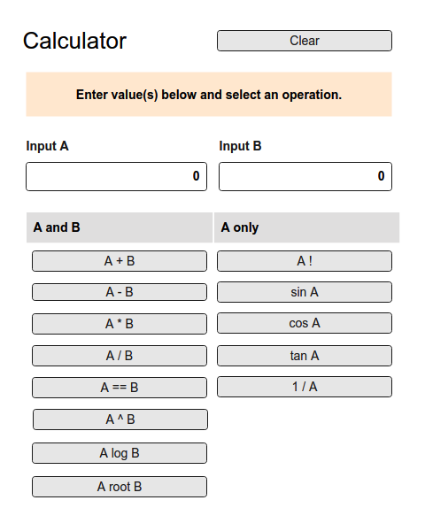
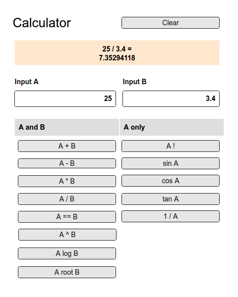
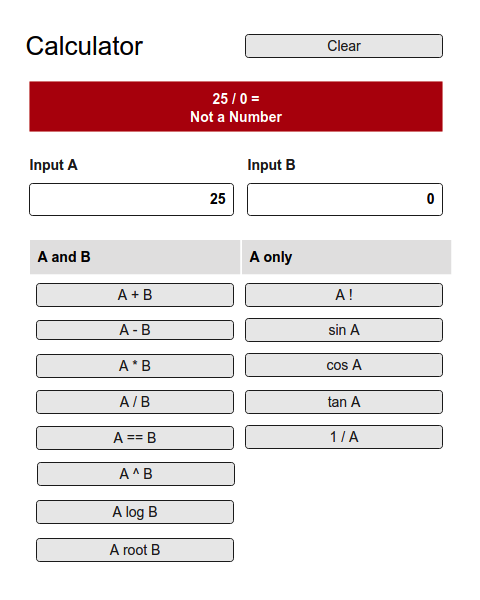
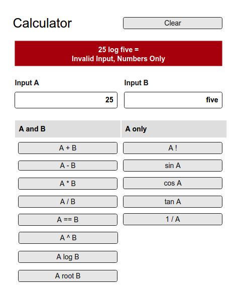
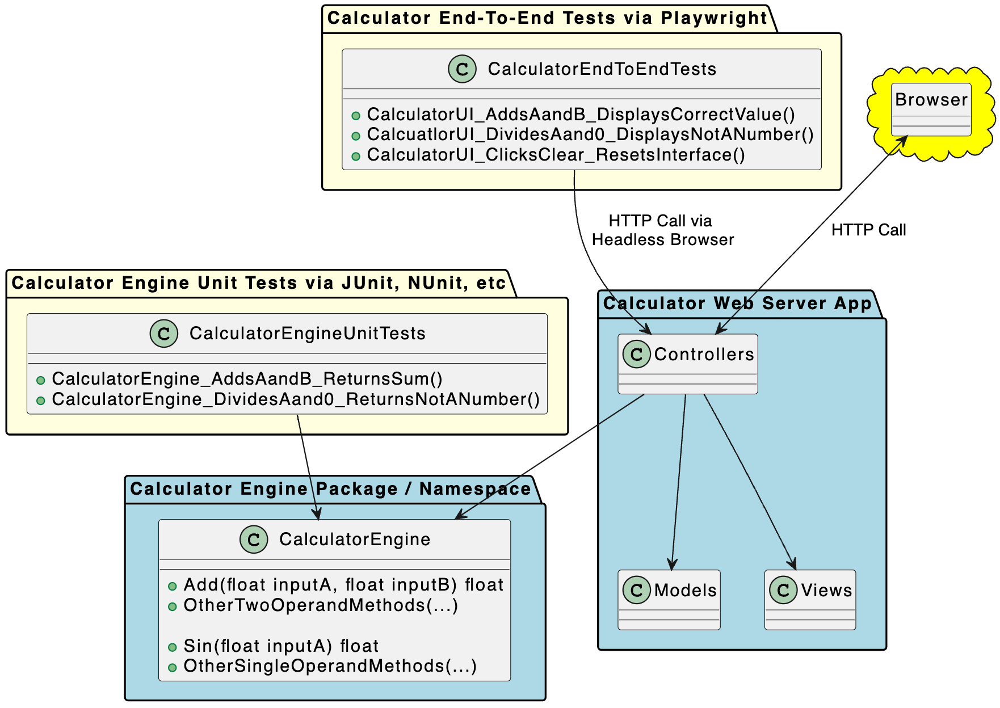

# KSU SWE 3643:<br/>Software Testing and Quality Assurance<br/>Semester Project

You will execute a semester project to help reinforce some of the testing concepts covered this semester and gain valuable coding practice and source control usage along the way.

The project includes:

-  Creating a simple web-based calculator that performs basic floating point calculations on single and double operands, including:

   -  Add, subtract, multiply, divide, equals, power, log, and root, and
   -  Reciprocal, sin, cosine, tangent, and factorial.

   You can build your web-based calculator in Java, C#, or Python. You will follow the [Test Driven Development (TDD) methodology](https://testdriven.io/test-driven-development/) to create your calculator logic and unit test it independent from the UI/web interface. To facilitate unit testing, the web-based UI will *reference* your calculator logic rather than tightly couple the logic into your UI code. You will write all of your unit tests using the [industry-standard AAA pattern (arrange, act, assert)](https://medium.com/@pjbgf/title-testing-code-ocd-and-the-aaa-pattern-df453975ab80) and [follow the `UnitOfWork_StateUnderTest_ExpectedBehavior` naming convention](https://osherove.com/blog/2005/4/3/naming-standards-for-unit-tests.html).

-  Adding unit tests to the calculator classes (the classes that perform the calculations) to achieve 100% coverage of the calculation methods.

-  Performing automated end-to-end testing on your web-based UI using [Playwright](https://playwright.dev/) scripts.

-  Writing documentation in [Markdown](https://www.markdownguide.org/) describing the runtime environment, how to execute your project from the command line, and how to execute your tests from the command line.

-  Producing a 5-to-8 minute video demonstrating your completed application, a demonstration of running your unit tests and Playwright scripts from the command line, and show that you reached 100% coverage of your calculator logic using your IDE.

-  Checking all of your source code, tests, and documentation into GitHub.

### Introductory Presentation

[There is a PowerPoint presentation](presentation.pptx) that summarizes this document [(there is also a PDF version)](presentation.pdf).

The material in this document is more specific than the presentation. Consider this document the canonical set of requirements for your project.

## Your Team

You will execute the project either alone as a **Team of 1** or with a single partner as a **Team of 2**.

-  **Team of 1: Work Alone**<br/>You will execute the entire project alone. This is a good option if you are confident in your abilities, prefer to work alone, like to have high levels of control over your projects, or have a hard time scheduling with another person. **If you work alone, you are responsible for all the work.** This was always my preferred choice when I was a student because it left me in 100% control of my success.
-  **Team of 2: Work with a Partner**<br/>You and a teammate will execute the entire project and share the same grade. This is a good option if you find someone who is a good complement to your abilities or shares a similar schedule as you. **Remember - you will share the same grade, so choose wisely.** Sometimes teammates let you down and you must shoulder the burden to ensure your own personal success is not impacted. The possibility exists that your teammate will drop the course. You must be ready to deliver if your teammate does not deliver.

[You will enter your team information into the spreadsheet at this link](https://docs.google.com/spreadsheets/d/1j31OuRBPvU4Lo9lRFAemO7iI38zD6t43fZxSJn1K-Nw/edit?usp=sharing) by Thursday, February 8th. Your first project grade is a short submission in D2L confirming that your team information is in the spreadsheet.

**Your team cannot change after Thursday, February 8th. Choose carefully.**

Your team information spreadsheet includes your team GitHub repo, team size (1 or 2), and team contact information.

[](https://docs.google.com/spreadsheets/d/1j31OuRBPvU4Lo9lRFAemO7iI38zD6t43fZxSJn1K-Nw/edit?usp=sharing)

## Your Web Application

### Browser Interface

Your web application will perform simple calculations on one or two operands. The default state of the [browser interface](https://app.moqups.com/MvLts3wDDVQ8TNQBIdQN5nOCilbNhjYo/view?ui=0) will look like the following when started (and following clicking the **Clear button**):

[](https://app.moqups.com/MvLts3wDDVQ8TNQBIdQN5nOCilbNhjYo/view?ui=0)

When valid input is available in one or both of the input fields and you click an operator button in a browser, the application will compute the value on the server and display the calculation and result in the highlighted result box as follows:

[](https://app.moqups.com/MvLts3wDDVQ8TNQBIdQN5nOCilbNhjYo/view?ui=0)

If you enter invalid data, such as attempting to divide by 0, the result box will turn red and display **Not a Number**:

[](https://app.moqups.com/MvLts3wDDVQ8TNQBIdQN5nOCilbNhjYo/view?ui=0)

If you enter text in one of the input boxes, the result box will turn red and display **Invalid Input, Numbers Only**:

[](https://app.moqups.com/MvLts3wDDVQ8TNQBIdQN5nOCilbNhjYo/view?ui=0)

Clicking the **Clear** button will reset the result box, and the input boxes to their default state.

[Please review the prototype user interface at this link.](https://app.moqups.com/MvLts3wDDVQ8TNQBIdQN5nOCilbNhjYo/view?ui=0) You can move through the interface examples by clicking anywhere on the pages.

### Architecture

Your application will separate calculation logic from web logic. This will simplify unit testing, help your code achieve the single responsibility principle, and decouple the logic engine from the user interface.

[](https://www.plantuml.com/plantuml/uml/VL9DQzj04BthLmp99IQnstCf9R9II0fnJAsabq9Oxqxa9QDTiHzMGyb_hwQAy1fRteFNmxptTkOzNViWN8WrPOB8jhN-eqsLPOsGhw92E2i4oKWYM0VVJQKDmlAZzGaMeaRV8V4CpabNcx2cYDdV3BeZINWFE_O7kM_okOHSgOiNiYA0DaqC-HKarNpILmd-8MpGbQrzQD09e-unRApo5xFPR98bi9KsUx8ZGXsi8ZocnQ3tB7i_wSAZqG5AzC73LWlumVKLBFeBWvmDdhmX-ygkZ7Z2b5weD-Vo0F7SEULpOTJy-IU6w8nVnVfYCeQ-qLkjy3_Xyq1Os90lOhr6npnU3quCCfr-E-YE6l8Brx12jqK7UTCSVWhzrlTM8VbT_QInJSh2ck0i4JhFewKrJpF03nk3RjePMM0qK3KjxRIxaZoN9DvQnulivmZ7SrIbvPyanRrW7k-I26-qRpfrNrZdK8OdGH4vb8Ga0Z5fFyc1bqPvzAc2j7pr1Q5mNVmUWxyp0TsBaBWB7qRdP-zIBx_0RLak6KvipMy3joWKeVSmTxRrwDXPIJOgE4zSscY58BMJXBrd2G66V_3rn7EiUur6nPh-0G00)

You will note:

-  The Calculator Engine performs the calculation logic and returns floating point values.
-  The Calculator Web Server App references the Calculator Engine. The Web Server App generates the user interface, calls the Calculator Engine, and returns results to the user's browser.
-  The Calculator Engine Unit Tests reference the Calculator Engine and do not test the Web Server App.
-  The Calculator End-to-End Tests connect to your Web Server App and test the user interface end-to-end (which includes calling the Calculator Engine).

You must carefully layout your code to achieve this architecture. In particular, you cannot closely couple the calculator logic with the calculator UI. For example, if you actually perform a calculation in the Web Server App, you are doing it wrong. The Web Server App requests calculations from the Calculator Engine classes.

Without a logical separation of the Calculator Engine from the Web Server App, you will have a very challenging time writing unit tests that only focus on the Calculator Engine. Remember - unit tests focus on classes and methods. Higher level forms of tests such as integration tests and end-to-end tests combine multiple modules and systems together. To write effective unit tests, you cannot mix web server routing and rendering logic with your domain logic.

### Calculator Operations

The calculator interface and logic will support the following operations:

| Operation           | Button   | Inputs | Returns                                                  | Example                                                      | Notes                                                        |
| ------------------- | -------- | ------ | -------------------------------------------------------- | ------------------------------------------------------------ | ------------------------------------------------------------ |
| Add                 | A + B    | A, B   | A plus B                                                 | 5.5 + -3.15 = 2.35                                           |                                                              |
| Subtraction         | A - B    | A, B   | A minus B                                                | 27.93 - 4 = 23.93                                            |                                                              |
| Multiplication      | A * B    | A, B   | A times B                                                | 5 * 7.1 = 35.5                                               |                                                              |
| Division            | A / B    | A, B   | A divided by B                                           | 3.0 / 9.0 = .33333333                                        | The following values return **Not a Number**:<br />- B (denominator) equal to 0 |
| Equals              | A == B   | A, B   | 1 when equivalent to 8 points of precision. 0 otherwise. | 0.333333== 0.333333 = 1,<br />0.33333333== 0.33333334 = 0,<br />0.333333331== 0.333333332 = 1 | Comparison is to 8 decimal points. Thus, 0.333333331 and 0.333333332 are considered equal. |
| Raise to Power      | A ^ B    | A, B   | A raised to the power of B                               | 2 ^ 3 = 8, <br />5 ^ 2 = 25,<br />5 ^ -3 = 0.008             |                                                              |
| Logarithm of number | A log B  | A, B   | Exponent of logarithm A at base B                        | 8 log 2 = 3,<br />25 log 5 = 2                               | The following values return **Not a Number**:<br />- Values of A less than or equal to 0<br />- Values of B equal to 0 |
| Root of number      | A root B | A, B   | Bth root of A                                            | 8 root 3 = 2,<br />25 root 2 = 5                             | The following values return **Not a Number**:<br />- Values of B equal to 0 |
| Factorial of number | A !      | A      | A * (A-1) * (A - ...) * 2 * 1                            | 5 = 120,<br />-5 = -120<br />0 = 1                           | By convention, 0 returns 1.                                  |
| Sine of A           | sin A    | A      | sin(A)                                                   | 360 = 0<br />-360 = 0<br />0 = 0,<br />1 = 0.0174524         |                                                              |
| Cosine of A         | cos A    | A      | cos(A)                                                   | 360 = 1<br /><br />-360 = 1<br />1= 0.99985                  |                                                              |
| Tangent of A        | tan A    | A      |                                                          | 360 = 0<br />-360 = 0<br />1=0.0174551                       |                                                              |
| Reciprocal of A     | 1 / A    | A      | 1 divided by A                                           | 8 = 0.125<br />-4 = -0.25                                    | The following values return **Not a Number**:<br />- Values of A equal to 0 |
| Clear               | Clear    |        | Enter value(s) below and select an operation.            |                                                              | Set the highlight color to pale yellow.                      |

### Languages, Web Server Architectures, and Test Runners

Your choice of languages, server architectures, and test runners includes:

-  C#
   -  ASP.NET MVC + NUnit + Playwright
   -  ASP.NET Blazor Server + NUnit + Playwright
-  Java
   -  Spring MVC + JUnit + Playwright
   -  Struts + JUnit + Playwright
   -  Grails + JUnit + Playwright
-  Python
   -  Flask + Pytest + Playwright

### I Am Freaking Out! I Have Not Done Web Development! What Should I Pick?

Every framework listed has huge communities of developers who have posted outstanding tutorials on the web and on sites like YouTube. You will have no trouble finding resources. You must make the time to try the tutorials and learn the basics of what you choose. This is exactly how professional engineers operate when they are assigned a new project. I often purchase a cheap course from Udemy when learning a new technology. They have excellent material and the cost is often less than $20.

For best results, stick with the language you know best unless your teammate (if you have one) is even more confident in another language. Do not pick what looks the most cool or what you think will look best on your resume... pick what you have the best chance of performing well on the project. I have seen several students start with something ambitious and fail when they should have picked something more reasonable and succeeded. The goal of our profession is working software... customers do not care how cool the framework is or how beautiful your code is if it does not meet their requirements. *Never forget this.*

**If you are not confident in any of the options above, pick C# and Blazor Server.** I am most proficient with C# and have a lot of experience with Blazor Server, so I can provide the most help and advice with those choices.

#### Are You Going to Teach Me Everything I Need to Know?

No, but I will show you the way to success.

Your First Year instruction gave you the programming basics you need to execute this project. You also have some experience with projects and working in teams from Software Engineering 1. Finally, you have been learning problem solving approaches your entire academic career.

You will have to watch some YouTube videos, read some blog posts, visit the manufacturer's sites, and do some independent research. This is how the real world works. Your future employer is not going to take you by the hand with every new project.

*No one can teach you how to program but yourself.* The only way to be a good programmer is to do the work. Sometimes that will mean long, frustrating nights at your computer working out problems and endlessly researching obscure compiler errors. Everyone in this field has had those days and nights.

You can do this. Be confident in yourself and budget your time wisely. I am here to help you but you must do the work. Do *not* wait until the last minute to engage this project.

#### I Still Feel Very Nervous

You must learn some things on your own, but you are not alone.

I am going to help you when you get stuck.

We are dedicating the last four lecture periods of the class to project work. I will be in the classroom to help people who need advice, additional resources, etc.

Every semester I see nervous students achieve great things when given a bit of a push and a lot of support. **You can do this.**

#### This is a Testing Class. Why Are We Writing a Web Application?

1.  You need practice building applications, learning new frameworks in short timeframes, and building the confidence that you can tackle problems like this one.
2.  You need source control experience.
3.  You need experience presenting your work.
4.  You need to experience how to separate UI concerns from logic. Most of your student work so far has tightly coupled logic and user interface code.
5.  You to need experience writing unit tests for logic you create. You will see that there are certain approaches that work better than others to effectively automate your testing.
6.  You need to experience writing end-to-end tests. That is easiest to do with web frameworks. Scripting end-to-end testing for UI frameworks such as JavaFX, Winforms, or TKinter can be very arcane.
7.  One of the most pervasive problems in our field is that the development process is often separate from the test process. The Test Driven Design (TDD) process will help you write better code that is durable and easier to maintain/refactor over time. Your unit tests will help document how your application works simply by showing how the components and methods work are called, work together, and what they return. Therefore, you need to write tests *as you develop* an application.

#### I Know React/Angular/Vue/otherSPAFrameworkHere. Can I Use That?

No. You must use a server framework that renders HTML on the server. SPA development is prohibited due to complexity and higher risk of overall project failure.

### Source Control via Git and GitHub

Your project will be hosted on a [public GitHub repository](https://docs.github.com/en/repositories/creating-and-managing-repositories/quickstart-for-repositories). Each team will have a separate GitHub repository created by the team member(s).

If you have never used source control, [watch some videos on `git`](https://www.youtube.com/results?search_query=git+for+beginners) and create a free GitHub account. If you are uncomfortable working with command line tools, install GitHub Desktop or GitKraken (my personal preference) to give you a friendly interface.

`git` is *essential* for all software engineers regardless of industry and skill level. Do not graduate without expertise in source control, including proficiency in branching, merging, and pull requests. Note that these more advanced topics are not taught by KSU, so you need to make this a personal goal. Use this project to get started learning `git` and carry your knowledge forward after the course ends.

[The best developers *always use source control even when working alone*.](https://dev.to/nash4253/why-source-control-is-important-for-developers--5d8j) It is an essential skill you must develop.

## Documentation Written in Markdown

All documentation will be written in [Markdown](https://www.markdownguide.org/) and checked into your team GitHub repository.

Project documentation will include a README.md file in the root directory of your GitHub repository that includes:

-  A short description of what is in the repository.
-  Instructions how to build and execute the application from the command line, including all environment dependencies.
-  Instructions how to execute the unit tests and Playwright tests from the command line.
-  A link to your Final Video Presentation.

Writing Markdown is easy. I highly recommend writing Markdown using an IDE with a Markdown plugin (all JetBrains IDEs support this), Visual Studio Code with a Markdown extension, or a dedicated Markdown editor such as Typora.

*I am a big fan of [Typora](https://becomeawritertoday.com/typora-review/).* It is cross platform, visually clean, and has strong spell checking (a curiously unique feature in the Markdown world). I recommend giving it a try. I use it for all my work. It is a licensed tool, but the cost is very low ($15!).

Markdown is not tool specific, so whether you use Typora, an IDE, VS Code, or even write it by hand, the output will (generally) operate identically.

Great engineers are great communicators. We must reliably communicate very complex ideas to many people. Learn to write effectively and get the best writing tools you can afford. Be opinionated and passionate about the tools you use... they say a lot about you (I always ask what tools people love in interviews).

## Final Video Presentation

Your completed project will include a 5-to-8 minute video presentation.

Your video will demonstrate:

-  starting your application from the command line and using it from a web browser, and

-  executing your unit tests and playwright tests from a terminal/command line, and

-  showing 100% code coverage from your IDE.

Your presentation can be hosted on a public link at YouTube or Vimeo or you can check in the video file to your team GitHub repository.

Avoid producing a terrible, dull, hard to understand video. I must watch dozens of these, so have pity. 

Put some effort into this to make it organized, succinct, and interesting. Consider writing a script and perhaps use a PowerPoint presentation to frame each section of your video. Every semester someone does a video that just blows me away. This is a good skill to develop; it helps you showcase your work and promote yourself.

## The KSU Writing Center

Do not forget that you get extra credit for visiting the [KSU Writing Center](https://writingcenter.kennesaw.edu/) up to two times. This will help you learn to be a better writer and communicator. Towards the end of the semester after you have pounded out your project documentation, go to the KSU Writing Center and have them help you polish your work. 

The best documentation is thorough, concise, well-organized, and targeted at a specific audience. I recommend taking advantage of this free resource, both for the expertise you might gain and the extra credit you might want if you find yourself with a borderline grade.

Areas where you might consider using the KSU Writing Center include:

-  Organizing and editing your README.md file. Write it first, then ask for help reviewing the material, using proper grammar, avoiding [passive voice](https://www.grammarly.com/blog/passive-voice/) in favor of active voice, writing meaningful titles, etc. This file targets a technical audience. I also suggest [reviewing some resources how to write a good README file](https://www.freecodecamp.org/news/how-to-write-a-good-readme-file/) before getting started.
-  Help writing a script for your Final Video Presentation. Most students do not do this... typically these videos are just rambling recordings hitting the requirements. These are not very engaging and certainly do not showcase your hard work. The best videos use slides to introduce each section, are carefully planned and recorded, and are a bit [shorter (shorter is good assuming you cover the required material)](https://www.npr.org/sections/13.7/2014/02/03/270680304/this-could-have-been-shorter). Do not forget to [read some suggestions how to present your work effectively](https://animoto.com/blog/video-ideas/video-presentation-ideas).

If the Writing Center does not do it for you, do not give up on becoming a better communicator. Two writing resources I have found both engaging and somewhat inspiring are:

-  [**On Writing** by Stephen King](https://www.fcusd.org/cms/lib/CA01001934/Centricity/Domain/3762/Stephen%20King%20On%20Writing.pdf)<br/>*This is such an entertaining book. **I am serious.** You will never look at adverbs the same way again.*

-  **[Elements of Style** by W. Struck, Jr. & E.B. White](https://faculty.washington.edu/heagerty/Courses/b572/public/StrunkWhite.pdf)

   *This book is packed with wisdom. Some of the grammar ideas presented are not as relevant today as when it was produced, but overall it is a gem. Following is a favorite quote from the text that I think applies to damn near everything we do in our professional lives:*

   ```html
   It is an old observation that the best writers sometimes
   disregard the rules of rhetoric. When they do so,
   however, the reader will usually find in the sentence
   some compensating merit, attained at the cost of the
   violation. Unless he is certain of doing as well, he
   will probably do best to follow the rules. After he has
   learned, by their guidance, to write plain English 
   adequate for everyday uses, let him look, for the 
   secrets of style, to the study of the masters of 
   literature.
   ```

## Submission Schedule

The project is due on Friday April 26th at 11:59 PM. At that time, all GitHub repositories will be automatically cloned by the instructor for grading.

To help you stay on schedule, you will submit two progress reports on the following dates explaining where you are in the project. 

-  **Progress Report 1 - Monday 3/18<br/>**

   I recommend having your web application fully operational by this point.

-  **Progress Report 2 - Monday 4/15<br/>**I recommend having 100% unit test coverage by this point.

Each progress report is 1.5% of your overall project score. You will submit them via a D2L dropbox. These are obviously very easy points towards your project.

Other important project dates include:

-  Project Work Days<br/>*No lecture, Jeff in classroom to assist teams. Attendance is optional.*
   -  Monday 4/15
   -  Wednesday 4/17
   -  Monday 4/22
   -  Wednesday 4/24

-  **Project Submission - Friday 4/26 at 11:59 PM**

   Late submissions receive the penalties outlined in the Syllabus.

You do not have to be on the schedule I recommend, but you should do your best to be close. Waiting until the last minute to do this project will likely result in a very poor grade (and remember - your semester grade cannot be higher than one letter grade higher than your project score). If you are starting from zero by the Project Work Days , there will not be much I can do to help you. I am available to help you with problems - not help you build your application at the last minute.

## Submission Components

Your finished project will include:

-  A URL to your public team GitHub repository.
-  Working source code for your Calculator web application checked into your public team GitHub repository. Your source code will include *all assets necessary* to compile and execute your project. Every semester someone submits a single class or is missing large blocks of essential code or that is full of compiler errors. Do not be that person. Working code is what software engineers produce.

   IMPORTANT: Code that will not compile will automatically reduce your project score by 25% or more (depending on severity).
-  Working unit tests providing 100% coverage of all Calculator logic (some methods require multiple tests to test all requirements, such as division to check both the division function and detecting division by zero). All unit tests will be written using the [AAA pattern](https://medium.com/@pjbgf/title-testing-code-ocd-and-the-aaa-pattern-df453975ab80) and follow the [`UnitOfWork_StateUnderTest_ExpectedBehavior` naming convention](https://osherove.com/blog/2005/4/3/naming-standards-for-unit-tests.html).
-  Working end-to-end Playwright tests testing various Calculator user interface functions including several single and double operand functions, the clear function, "not a number" conditions, and invalid input. All end-to-end tests will be written using the [AAA pattern](https://medium.com/@pjbgf/title-testing-code-ocd-and-the-aaa-pattern-df453975ab80) and follow the [`UnitOfWork_StateUnderTest_ExpectedBehavior` naming convention](https://osherove.com/blog/2005/4/3/naming-standards-for-unit-tests.html).
-  A detailed README.md written in Markdown that explains the environment configuration and steps to execute your Calculator web application and tests from the command line. This file will also include a link to your final video presentation.
-  A video presentation checked into your team GitHub repository or hosted on YouTube/Vimeo that  demonstrates your completed application, unit tests, and 100% coverage in your IDE.

## Grading

I will grade your project between the submission date and the day final grades are due. This will be a significant effort, so please do not submit late if you can avoid it (plus your grade will suffer as well).

This project is **25%** of your semester grade, so it is essential that you yourself enough time to complete it.

Your final grade can only be one letter grade higher than your project. If you do poorly on the project, you will do poorly overall.

If your project meets the requirements in this document, not only will you receive a top score, but you will have earned valuable expertise and enhanced your GitHub repository with a great looking project.

## Collaboration

You can collaborate with your teammate, but not with other teams. Each team's work must be their own.

If you choose to work alone, you are committing to that decision for the duration of the project. You cannot change your mind later.

When you are stuck, you are welcome to ask for advice from classmates or visit the KSU computer lab to get you moving again, *but* *your work must be your own.*

Do not consider outsourcing your project to a homework help site like Chegg. I have had that happen before. I am pretty good at spotting unusual work and I will be reading your code. If I suspect your work is not your own, I will ask you to join me on a video call and explain your work line by line. If I remain unconvinced the work is yours, I will ask my KSU colleagues to do additional reviews.

AI tools such as ChatGPT cannot help you much with this project. But even if they can, you are cheating yourself of valuable experience you will need after you graduate.  AI is going to continue to reshape our profession, but the top engineers will remain the ones who know how to prompt an AI and recognize when it is making a mistake.

## When You Need Help

**I will try to assist you, but I will not write your code.**

-  Come to some or all of the project workdays at the end of the semester for help. See the Syllabus for the dates. Last minute frantic emails just before the project is due are unlikely to get a helpful response.
-  When you are stuck, you are welcome to ask for advice from classmates or visit the KSU computer lab to get you moving again, *but your work must be your own.*
-  I am not a miracle worker. You need to do your best to solve your problem (or at least understand it) before asking for help.
-  I am most proficient with C#, so consider picking that language if you anticipate needing a lot of help.

When you ask me for coding assistance:

-  Be very specific. If you are vague, I cannot help you. ”It’s not working.” is not specific.
-  Always include your team’s GitHub repository URL.
-  Check the offending code into your GitHub repository so I can look at it and possibly run it. If your code is not in your GitHub repository, I will not attempt to compile or run it. [Also consider creating a separate source branch](https://git-scm.com/book/en/v2/Git-Branching-Branches-in-a-Nutshell) before sharing problematic code with me to avoid breaking operational code in your main code trunk.
-  To compile and run your code, your **README.md** must have the environment configuration instructions and execution steps. Keep those accurate and up-to-date.

# Detailed Instructions

**Final Details Coming Soon**

-  Requirements (numbered for easy traceability):  
   -  Numbered application requirements, 
   -  Unit testing requirements
   -  Unit testing coverage requirements
   -  End-to-end testing requirements
   -  Documentation requirements
   -  Final presentation requirements.

-  Technical Design
   -  How to (generally) structure the project (this will vary by language and framework) and some helpful resources

-  Visual Design
   -  [UI mockup](https://app.moqups.com/MvLts3wDDVQ8TNQBIdQN5nOCilbNhjYo/view/page/ac244bb80?ui=0)


# Grading Rubric

**Final Details Coming Soon**

-  Did the README explain exactly how to configure the environment and execute the project?
-  Is the code structured in a way that separates logic from presentation to facilitate unit testing?
-  Does the project run from the command line?
-  Do the unit tests run from the command line?
-  Do the end-to-end tests run from the command line?
-  Did the project meet the UI requirements?
-  Did the project meet the unit test requirements?
-  Did the project reach 100% unit test coverage of the calculator logic?
-  Did the project meet the end-to-end Playwright testing requirements?
-  Was the presentation well organized and professionally executed?

